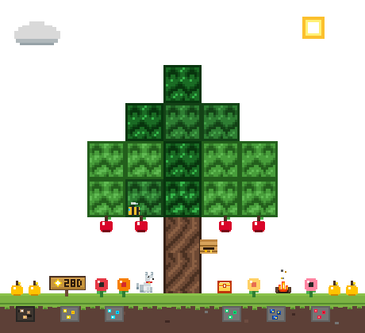
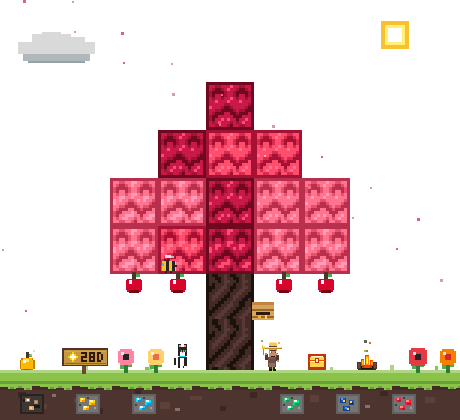
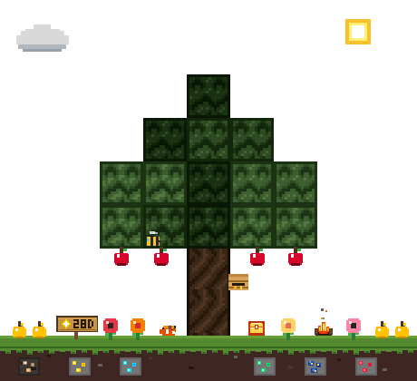
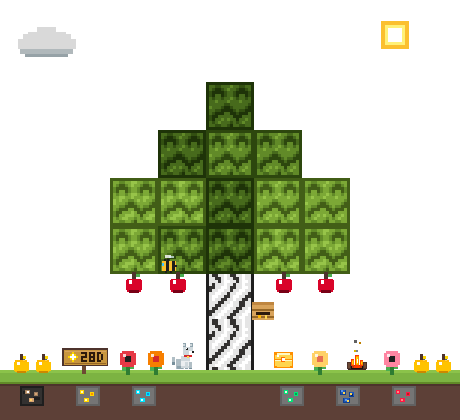
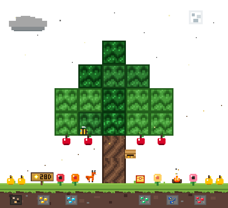
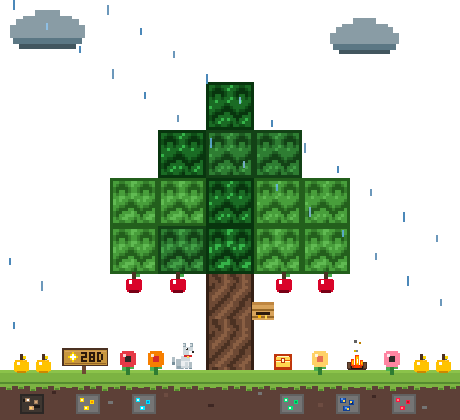
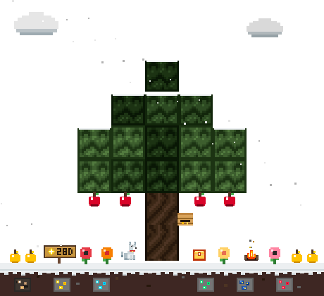
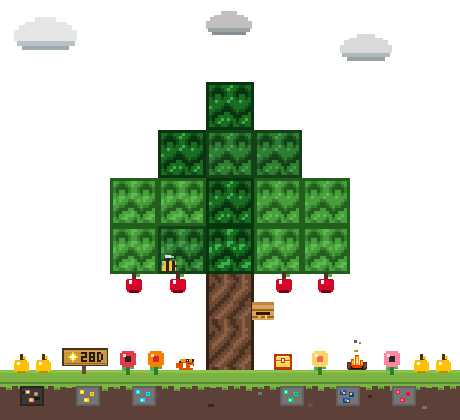

<div align="center">

# gh-tree 🌴


<!-- commit-tree-start -->

<!-- commit-tree-end -->


<p>
  <b>Renders your GitHub contribution graph and pull requests as an animated Minecraft Oak, Sakura, Spruce, or Birch Tree with transparent background, live weather, and gamer collectibles.</b>
</p>

</div>

---

- **Minecraft Tree Biomes 🌸🌲⚪🌳** — choose between **Sakura / Cherry Blossom** (with falling pink petals), **Spruce Taiga**, **Birch Forest**, or classic **Oak**.
- **Minecraft Oak / Sakura Leaves** — weekly commits drive the lushness and color intensity levels (Level 0 dormant to Level 4 rich emerald/pink) across the 14 canopy blocks.
- **Minecraft Bee 🐝 & Streak Beehive 🍯** — an animated buzzing bee with fluttering wings and a wooden beehive on the trunk celebrating your active commit streak.
- **Wooden Stat Signpost 🪧** — a neat pixelated wooden signpost on the grass lawn displaying your live commit streak (`⚡ 14d`).
- **Underground Ore Blocks 💎 (Netherite, Gold, Diamond, Emerald, Lapis, Redstone)** — embedded in the dirt layer featuring special **Netherite** for repo owners, **Lapis Lazuli** for contributors, and milestone ores.
- **Minecraft Flowers 🌸 (Open PRs)** — up to 4 colorful flowers (Poppies, Dandelions, Tulips, Sakura) planted on the lawn.
- **Minecraft Red Apples 🍎 (Merged PRs)** — up to 4 ripe red apples hanging beneath the canopy leaf blocks.
- **Minecraft Golden Apples 🍏✨ (Assigned PRs / Reviews)** — up to 4 enchanted golden apples placed on the lawn.
- **Live Weather & Day/Night Cycle ☀️🌕🌧️❄️☁️** — real-time weather integration (via Open-Meteo) rendering animated Sun, Starry Night Moon & twinkling stars, Rain streaks & splashes, Snowfall & snow caps, or Drifting clouds.
- **Transparent Background** — pure alpha transparency that seamlessly blends into dark and light GitHub profiles and READMEs.

---

## Biome & Tree Varieties Showcase 🌸🌲⚪🌳

| **Classic Oak 🌳** (`tree-type: oak`) | **Sakura Cherry Blossom 🌸** (`tree-type: sakura`) |
| :---: | :---: |
|  |  |
| *Classic Oak, Bee, Beehive & Ore* | *Cherry blossom pinks & falling petals* |

| **Taiga Spruce 🌲** (`tree-type: spruce`) | **Birch Forest ⚪** (`tree-type: birch`) |
| :---: | :---: |
|  |  |
| *Dark coniferous needles & spruce bark* | *White notched birch bark & olive leaves* |

---

## Weather & Day/Night Showcase 🌦️

| **Sunny ☀️** (`weather: sunny`) | **Starry Night 🌕✨** (`weather: night`) |
| :---: | :---: |
|  |  |
| *Glowing Minecraft Sun & solar flares* | *Minecraft Moon, craters & twinkling stars* |

| **Rainy 🌧️** (`weather: rain`) | **Snowy ❄️** (`weather: snow`) | **Cloudy ☁️** (`weather: cloudy`) |
| :---: | :---: | :---: |
|  |  |  |
| *Slanted rain streaks & splashes* | *Fluttering snow & snow-capped leaves* | *Multi-layered drifting overcast clouds* |

---

## 🎮 Minecraft Collectibles & Game Mechanics

gh-tree turns your GitHub contributions into living Minecraft collectibles and milestones:

### 💎 Underground Ore Blocks

Embedded in the underground dirt layer beneath your tree, 6 distinct ore blocks unlock as you hit maintainer, contribution, and productivity milestones:

| Ore Block | Appearance | Unlock Condition | What It Represents |
| :--- | :---: | :--- | :--- |
| **Netherite / Ancient Debris** 🪨 | Dark obsidian with metallic bronze & gold veins *(Slot 0: Far-Left)* | **Repository Owner / Maintainer** (`is-owner: true` or auto-detected) | **👑 Project Maintainer & Creator** — the rarest Minecraft material, awarded exclusively to the repository owner! |
| **Gold Ore** 🪙 | Radiant gold nuggets *(Slot 1: Mid-Left 1)* | • **Current streak ≥ 7 days**, *OR*<br>• **≥ 50 total commits** | **⚡ Streak Dedication** — milestone for sustained rhythm and week-long consistency. |
| **Diamond Ore** 💎 | Cyan crystalline flecks *(Slot 2: Mid-Left 2)* | • **≥ 25 total commits** in date range, *OR*<br>• **≥ 1 merged PR** | **💎 Active Contributor** — milestone for regular code contributions and PR merges. |
| **Emerald Ore** ❇️ | Bright emerald green gems *(Slot 3: Mid-Right 1)* | • **≥ 100 total commits** in date range, *OR*<br>• Any weekly branch reaching **Level 4** (30+ commits/week) | **🏆 Power Contributor** — rare milestone awarded for high commit volume and intense development sprints. |
| **Lapis Lazuli Ore** 🔷 | Ultramarine blue crystals & gold pyrite *(Slot 4: Mid-Right 2)* | • **Open source contributor** (`is-contributor: true`), *OR*<br>• Any PR authored, merged, or reviewed | **🤝 Open Source Contributor** — special celestial blue ore celebrating community contributors and reviewers! |
| **Redstone Ore** 🔴 | Glowing crimson Redstone *(Slot 5: Far-Right)* | • **Merged PRs ≥ 2**, *OR*<br>• **Total PR activity ≥ 3**, *OR*<br>• **Current streak ≥ 14 days** | **⚙️ Engineering & Automation** — milestone honoring pull request lifecycle, code reviews, and multi-week streaks. |

---

### 🍃 Canopy Leaves & Trees
- **14 Weekly Canopy Blocks**: 14 distinct branches representing your recent contribution weeks.
- **Commit Intensity**: Leaf colors dynamically transition across 5 levels from **Level 0** (dormant/dry) up to **Level 4** (lush emerald or vibrant sakura pink) based on weekly commit volume.

### 🌸🍎🍏 Pull Request Collectibles
- **Flowers 🌸 (Open PRs)**: Up to 4 colorful Minecraft flowers (Poppies, Dandelions, Tulips, Sakura) planted across the grass lawn.
- **Red Apples 🍎 (Merged PRs)**: Up to 4 ripe red apples hanging beneath the canopy leaf blocks.
- **Golden Apples 🍏✨ (Assigned PRs / Reviews)**: Up to 4 enchanted golden apples placed on the lawn.

### 🪧 Wooden Stat Signpost & 🐝 Beehive
- **Wooden Stat Signpost 🪧**: Renders your active consecutive commit streak (`⚡ 14d`) using a pure pixel font and high-contrast golden star.
- **Beehive 🍯 & Animated Bee 🐝**: A wooden beehive appears on the trunk for active streaks (≥ 3 days) or ≥ 25 commits, while an animated Minecraft bee buzzes around the tree during fair weather.

---

## Quick Start (Profile README)

Add this simple workflow to your repository (e.g. your `username/username` profile README repository) at `.github/workflows/tree.yml`:

```yaml
name: Generate Commit Tree

on:
  schedule:
    - cron: '0 0 * * *' # Runs daily at midnight
  workflow_dispatch:

permissions:
  contents: write

jobs:
  update-tree:
    runs-on: ubuntu-latest
    steps:
      - uses: actions/checkout@v4

      - uses: nivinvysakh/gh-tree@main
        with:
          github-token: ${{ secrets.GITHUB_TOKEN }}
```

### Full Configuration Example

Customize your tree with biomes, live weather, and recency tuning:

```yaml
name: Generate Commit Tree

on:
  schedule:
    - cron: '0 0 * * *' # Runs daily at midnight
  workflow_dispatch:

permissions:
  contents: write

jobs:
  update-tree:
    runs-on: ubuntu-latest
    steps:
      - uses: actions/checkout@v4

      - uses: nivinvysakh/gh-tree@main
        with:
          github-token: ${{ secrets.GITHUB_TOKEN }}
          # Tree biome variety: oak | sakura | spruce | birch
          tree-type: "sakura"
          # Live weather from Open-Meteo for your city (auto-detects sun, night, rain, snow, clouds)
          city: "Tokyo"
          # Or manually force a weather condition: auto | sunny | night | rain | snow | cloudy
          weather: "auto"
          # Recency window in days for flowers (open PRs), red apples (merged PRs), and golden apples
          pr-days: "14"
          # Total days of history to fetch for commit canopy leaves (~14 weekly tiers)
          days: "140"
          # Whether to show the wooden streak signpost and animated bee
          show-signpost: "true"
          show-bee: "true"
```

> [!NOTE]
> If you want the tree to reflect contributions across private and external repositories, create a Personal Access Token (PAT) with `read:user` scope, save it in your repo secrets as `TREE_PAT`, and use `${{ secrets.TREE_PAT }}`.

### Embed in Your README.md
Add this anywhere in your `README.md`:

```markdown
<!-- commit-tree-start -->

<!-- commit-tree-end -->
```

The action will automatically generate `tree.gif`, update your `README.md`, and commit the changes!

---

## Action Inputs & Options

| Input             | Default      | Description                                      |
|-------------------|--------------|--------------------------------------------------|
| `github-token`    | *(Required)* | GitHub Token or PAT with `read:user` scope |
| `github-login`    | `repository_owner`    | GitHub username (defaults to repo owner)   |
| `tree-type`       | `oak`        | Biome tree type (`oak`, `sakura`, `spruce`, `birch`) |
| `show-signpost`   | `true`       | Render wooden streak stat signpost on the grass  |
| `show-bee`        | `true`       | Render animated Minecraft bee around the tree    |
| `is-owner`        | `auto`       | Sets repo owner status (unlocks Netherite Ore)   |
| `is-contributor`  | `auto`       | Sets contributor status (unlocks Lapis Lazuli)   |
| `output-path`     | `tree.gif`   | Filepath where the generated GIF is written      |
| `markdown-path`   | `README.md`  | Markdown file to update (set empty to disable)   |
| `auto-commit`     | `true`       | Automatically commits & pushes updated files     |
| `commit-message`  | `chore: update commit tree [skip ci]` | Commit message for auto-commit |
| `days`            | `140`        | Days of history to fetch for commit leaves (~14–20 weekly branches)|
| `pr-days`         | `14`         | Recency timer in days for flowers, red apples, and golden apples |
| `city`            | `""`         | City for live weather (e.g. `London`, `Tokyo`, `New York`, `Paris`)|
| `weather`         | `auto`       | Manual weather override (`auto`, `sunny`, `night`, `rain`, `snow`, `cloudy`)|
| `frames`          | `20`         | Number of animation frames in the loop           |
| `frame-delay-ms`  | `100`        | Frame delay in milliseconds                      |
| `width`           | `460`        | Canvas width in pixels                           |
| `height`          | `420`        | Canvas height in pixels                          |

## Action Outputs

| Output          | Description                                            |
|-----------------|--------------------------------------------------------|
| `gif-path`      | Absolute path to the generated GIF                     |
| `total-commits` | Total commits counted in the date range                |
| `current-streak`| Current consecutive active commit streak in days       |
| `open-prs`      | Total open pull requests authored by the user          |
| `merged-prs`    | Total merged pull requests                             |
| `assigned-prs`  | Total open pull requests assigned to the user          |
| `weather-type`  | Detected or active weather type (`sunny`, `night`, `rain`, etc.)|
| `weather-desc`  | Description of current weather                         |
| `tree-type`     | Selected biome variety (`oak`, `sakura`, `spruce`, `birch`)|

---

## Local Development & Testing

Generate local sample GIFs for all biomes and weather conditions without needing a token:

```bash
npm run generate:mock
```

Run test suite:

```bash
npm test
```

Build action bundle:

```bash
npm run build
```

## Contributors 👥
Big thanks to all of the amazing people who have helped by contributing to this project!

<a href="https://github.com/nivinvysakh/gh-tree/graphs/contributors">
  
</a>

---

<div align="center">

[](https://github.com/marketplace/actions/minecraft-commit-tree)

[](./LICENSE)

</div>